# 🔄 Content Publisher Weekly Automation Workflow

This diagram illustrates the "Zero-Touch" multi-channel pipeline for MandaAct.

```mermaid
graph TD
    %% Schedules (KST)
    Sunday((📅 Sunday 01:00)) -->|Trigger| TopicCommittee
    MWF((📅 Mon/Wed/Fri 01:00)) -->|Trigger| DraftWriter

    %% Phase 1: Topic Selection
    subgraph "Phase 1: Topic Committee"
        TopicCommittee[Script: select_topic.js]
        Archive[📄 ARCHIVE.md] --> TopicCommittee
        Trends[🌍 Market Trends] -.-> TopicCommittee
        TopicCommittee -->|GPT-4o API| AI_Topic[🤖 Topic Generation]
        AI_Topic -->|Enforce| MandaActAngle{MandaAct Angle?}
        MandaActAngle -- Yes --> QueueUpd[Update TOPIC_QUEUE.md]
        MandaActAngle -- No --> AI_Topic
    end

    %% Connection
    QueueUpd -->|Commit & Push| Repo[📂 GitHub Repo]
    Repo -->|Read Top Item| DraftWriter

    %% Phase 2: Draft Generation
    subgraph "Phase 2: Draft Writer"
        DraftWriter[Script: generate_draft.js]
        Context[📄 MandaAct_Context.md] --> DraftWriter
        Queue[📄 TOPIC_QUEUE.md] --> DraftWriter
        DraftWriter -->|GPT-4o API| AI_Draft[🤖 EN/KO Draft Generation]
        AI_Draft -->|Puppeteer| CoverGen[🖼️ Cover Image Generation]
        CoverGen --> QualityGate[📊 Quality Gate]
        QualityGate --> FinalDraft[📝 Final Drafts]
    end

    %% Phase 3: Delivery + Auto-Merge
    FinalDraft -->|Save| DraftFile[📄 drafts/*.md]
    DraftFile -->|Create Branch| Branch[🌿 draft/weekly-date]
    Branch -->|Push & Open PR| PR[🚀 Pull Request]
    PR -->|Enable| AutoMerge[🔄 Auto-Merge]

    %% Phase 4: Publish
    AutoMerge -->|Merge to Main| Merge[🔀 Merge]
    Merge -->|Trigger| AutoPublish[🚀 auto-publish.yml]
    AutoPublish -->|Exec| PublishScript[Script: publish.js]
    PublishScript -->|EN Route| DevTo[📢 Dev.to]
    PublishScript -->|EN Route| Hashnode[📢 Hashnode]
    PublishScript -->|KO Route| Blogger[📢 Blogger]
    FinalDraft -->|Export| Naver[📝 Naver Export]
```

## Workflow Steps

1. **Sunday (Topic Committee)**:
   - `select_topic.js` reads archive and trend signals.
   - Result: next topic is added to `TOPIC_QUEUE.md`.

2. **Mon/Wed/Fri (Draft Writer + Quality Gate)**:
   - `generate_draft.js` generates EN/KO drafts and cover images.
   - Quality gate validates content and updates queue state.
   - PR is created for review/merge.

3. **Auto-Merge**:
   - PR is set with `gh pr merge --auto`.
   - Required status checks gate merge.

4. **Publish on Main Push**:
   - `auto-publish.yml` publishes changed drafts.
   - Routing rule:
     - KO draft (`*-ko.md`) -> Blogger
     - EN draft -> Dev.to + Hashnode
